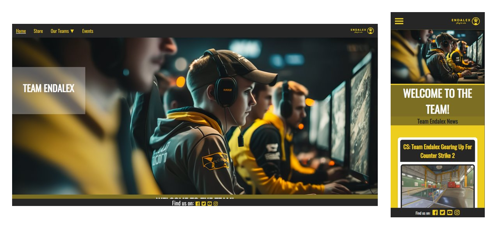
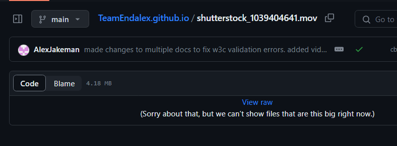

<h1 align="center">TeamEndalex<h1>

[View the live project here.](https://alexjakeman.github.io/TeamEndalex.github.io)

This is the main marketing website for all things Team Endalex. 
It is designed to be responsive and accessible on a range of devices, making it easy for potential fans to navigate.

<h2 align="center"></h2>

## User Experience (UX)

### User stories

#### First Time Visitor Goals

    1- As a First Time Visitor, I want to locate their social media links to see their followings on social media to determine how trusted and known they are.
            
    2- I also expect a clear and prominent "Ask us a question" form on the home page to assist me in case I have any questions or need support while navigating the website.

    3- As a First Time Visitor, I want to easily understand the main purpose of the site and learn more about the organisation.
            
    4- As a First Time Visitor, I want to be able to easily navigate throughout the site to find content.        
        
#### Returning Visitor Goals

    1- As a returning User, I want to sign up to the Newsletter so that I am emailed any major updates and/or changes to the organisation or it's teams.
            
    2- As a returning user of Team Endalex's portfolio website, I want to see the latest updates on the teams' performances in Counter Strike, PUBG, and Rocket League on the home page. The "Ask us a question" form should still be readily available on the home page in case I require any assistance during my visit.

    3- As a Returning Visitor, I want to find the best way to get in contact with the organisation with any questions I may have.
        
#### Frequent User Goals         

    1- I appreciate having a user-friendly "Ask us a question" form on the homepage that allows me to quickly submit inquiries or feedback about the website or Team Endalex's activities.
                        
    2- As a Frequent User, I want to check to see if there are any new team-based updates on the homepage
            
    3- As a Frequent User, I want to sign up to the Newsletter so that I am emailed any major updates and/or changes to the website or organisation.

### Design

#### Colour Scheme

The two main colours used are Dark Grey (#262626), and Burnt Yellow (#edcd1d) along with White (#fafafa/#fff) as an accent for the page.
I also use a Darker Yellow (#756409) to contrast with the Burnt Yellow (#edcd1d) for headers on different pages.

#### Typography

Oswald is actually a reworking of the classic style historically represented by the ‘Alternate Gothic’ sans serif typefaces. The characters of Oswald have been initially re-drawn and reformed to superior match the pixel grid of regular digital screens. Oswald is developed to be applied freely across the internet by net browsers on desktop computer systems, laptops and mobile devices.

#### Imagery

Imagery is important. The large hero image on the homepage is designed to match the colour theme of the page whilst adding intriguing visuals to entice users. It is contextual whilst also appealing to the eye.
The images within the store are designed to include the planned merchandise release from the organization, having a zoom effect to help add some interactiveness to the page

### Wireframes

#### Figma (Mobile/Desktop)

https://www.figma.com/file/PKzyS4SEn5Tz7YoC3Jse38/TeamEndalex-Figma---Mobile-%2F-Desktop?type=design&node-id=0%3A1&mode=design&t=VLBbM1FHORznqh9Z-1

## Features

- Responsive on all device sizes

- Interactive elements (cards on events page, interactive zoom on store products, drop-down on navbar)

- Help/Questions form on homepage

## Technologies Used

### Languages Used

- HTML
- CSS
- JavaScript

### Frameworks, Libraries & Programs Used

- Google Fonts (https://fonts.google.com/specimen/Oswald?query=oswald):
    Google fonts were used to import the 'OSWALD' font into the style.css file which is used on all pages throughout the project.

- Font Awesome (https://fontawesome.com/):
    Font Awesome was used on all pages throughout the website to add icons for aesthetic and UX purposes.

- GitHub (https://github.com/):
    GitHub is used to store the projects code after being pushed from Git.

- Figma (https://www.figma.com/)
    Figma was used to create the wireframes during the design process.

- Uiverse.io (https://uiverse.io/)
    Uiverse is a helpful site that gives open-source code for pre-designed HTML/CSS components.

- Adobe Stock (https://stock.adobe.com/)
    Some images on my website are source from Adobe Stock.

- Printify (printify.com/app/)
    Printify was used as a helpful tool to put my custom logos on merchandise for the store page.

## Testing

### Known Issues

    --   --r: calc(var(--position) - var(--offset));
    The above line is part of an external code block that is used for the functionality of the carousel within the Events page.
    -- The .mov file on the CSGO page works locally on branch/LiveServer however GitPages is not able to show files past a certain size, therefore it won't play when deployed to GitPages.
    

### W3C

- Checked all HTML and CSS manually using (https://jigsaw.w3.org/css-validator/#validate_by_input)

#### HTML

- There are no clear HTML issues within the project. Checked using W3C VS Code extension (https://marketplace.visualstudio.com/items?itemName=CelianRiboulet.webvalidator)

#### CSS

- There is one CSS issue within the project. Checked using W3C VS Code extension (https://marketplace.visualstudio.com/items?itemName=CelianRiboulet.webvalidator)
        

### Testing User Stories from User Experience (UX) Section
    
#### First Time Visitor Goals

    1- As a First Time Visitor, I want to locate their social media links to see their followings on social media to determine how trusted and known they are.
        a. The user can also scroll to the bottom of any page on the site to locate social media links in the footer.
        b. When a user selects a social media link, they will be redirected in a new tab to the social media link.
    
    2- I also expect a clear and prominent "Ask us a question" form on the home page to assist me in case I have any questions or need support while navigating the website.
        a. Once the new visitor has read the About The Team and About Our CEO sections, they will notice the Ask Us A Question section.
        b. When a new visitor fills out the question form, they will be re-directed to the confirmation page.
        c. When a user fills out the form with invalid input data, they will receive an error pop up message.

    3- As a First Time Visitor, I want to easily understand the main purpose of the site and learn more about the organisation.
        a. The user will open the homepage and be able to read about the ogranization and CEO, as well as recent news for the organization.
        b. When the user selects Read More on an article to understand better a news article, they will be redirected to an article page.
    
    4- As a First Time Visitor, I want to be able to easily navigate throughout the site to find content.        
        a. The user will be able to navigate through the site using the navigation bar at the top of the page.
        b. The navigation bar has an underline on whatever page they're on to help make it clear where they are at that current moment.
        c. At the bottom of the article pages and Subscription / Question confirmation pages, there is a 'Return Home' button.

#### Returning Visitor Goals

    1- As a returning User, I want to sign up to the Newsletter so that I am emailed any major updates and/or changes to the organisation or it's teams.
        a. When a user signs up to the newsletter using the form, they will be redirected to the confirmation page.
        b. The confirmation page will have a clear 'Return Home' button and a message that re-assures the user of confirmation that they've subscribed.
        c. When a user inputs invalid data in the form, they will be given a pop-up error above the field to assist them.

    2- As a returning user of Team Endalex's portfolio website, I want to see the latest updates on the teams' performances in Counter Strike, PUBG, and Rocket League on the home page. The "Ask us a question" form should still be readily available on the home page in case I require any assistance during my visit.
        a. On the homepage, there are three clear articles with images to attract users.
        b. The articles have the first paragraph of content and then a 'Read 'More' button that will redirect to an article page.
        c. The 'Ask Us A Question' form will be accessible in the sidebar on desktop and at the bottom of the page on mobile.

    3- As a Returning Visitor, I want to find the best way to get in contact with the organisation with any questions I may have.
        a. The 'Ask Us A Question' form will be accessible in the sidebar on desktop and at the bottom of the page on mobile.
        b.  When a user inputs invalid data in the 'Ask Us A Question' form, they will be given a pop-up error above the field to assist them.

#### Frequent User Goals    

    1- As a Frequent User, I appreciate having a user-friendly 'Ask us a question' form on the homepage that allows me to quickly submit inquiries or feedback about the website or Team Endalex's activities.
        a. The 'Ask Us A Question' form will be accessible in the sidebar on desktop and at the bottom of the page on mobile.
        b. The 'Ask Us A Question' form is styled to match the rest of the site, whilst also being a stand-out form on the homepage.
        c. b. The confirmation page will have a clear 'Return Home' button and a message that re-assures the user of confirmation that their question/feedback has been received.

    2- As a Frequent User, I want to check to see if there are any new team-based updates on the homepage
        a. The user would already be comfortable with the website layout and can easily navigate to the homepage articles or to the individual esports team pages.
        b. The articles have the first paragraph of content and then a 'Read 'More' button that will redirect to an article page.
        c. The article pages will have an image that is related to the context of the article, as well as a clear 'Return Home' button.

    3- As a Frequent User, I want to sign up to the Newsletter so that I am emailed any major updates and/or changes to the website or organisation.
        a. On the 'Store' page and 'Events' page, there will be a clear subscription form at the bottom of the page for the user to fill out.
        b. The form has validation on the field to ensure that a valid email is inputted by the user.
        c. The form leads to a confirmation page that has a message that confirms the user is subscribed, as well as having a clear 'Return Home' button.
    
### Further Testing

- The Website was tested on Google Chrome, Internet Explorer, Opera and Safari browsers.

- The website was viewed on a variety of devices such as Desktop, Laptop, iPhone7, iPhone 8 & iPhoneX

- A large amount of testing was done to ensure that all pages were linking correctly.

- Friends and family members were asked to review the site and documentation to point out any bugs and/or user experience issues.

## Deployment

### GitPages (https://alexjakeman.github.io/TeamEndalex.github.io)- 

The project was deployed to GitHub Pages using the following steps...

1. Log in to GitHub and locate the [GitHub Repository](https://github.com/)
2. At the top of the Repository (not top of page), locate the "Settings" Button on the menu.
    - Alternatively Click [Here](https://raw.githubusercontent.com/) for a GIF demonstrating the process starting from Step 2.
3. Scroll down the Settings page until you locate the "GitHub Pages" Section.
4. Under "Source", click the dropdown called "None" and select "Master Branch".
5. The page will automatically refresh.
6. Scroll back down through the page to locate the now published site [link](https://github.com) in the "GitHub Pages" section.
    
### LiveServer (localhost:5500)

The project was deployed to LiveServer using the following steps...

    1. Install Liveserver extension for Visual Studio Code.
    2. Select "Go Live" in the bottom right of VS Code.
    3. Observe browser window has opened with a local version of your website.

### Forking the GitHub Repository

By forking the GitHub Repository we make a copy of the original repository on our GitHub account to view and/or make changes without affecting the original repository by using the following steps...
1. Log in to GitHub and locate the [GitHub Repository](https://github.com/)
2. At the top of the Repository (not top of page) just above the "Settings" Button on the menu, locate the "Fork" Button.
3. You should now have a copy of the original repository in your GitHub account.

## Notables (regarding assessment criterias)

### File structure within project

- I would have preferred to keep image files, page html files and stylesheets all separate in order to improve organization, however GitPages was unable to work without having them all at the main branch level. As per commits in the early stages of the project, I did have separate folders for different files within the project.

## Credits

### Content

- All text-based content was written by the developer.
- Stock images were found from Adobe Stock (as per "Technologies used" section).
- Video was from ShutterStock (as per "Technologies used" section).
- Merchandise images were generated on Printify (as per "Technologies used" section).

### Acknowledgements

- Inspiration taken from "BIGClAN.gg" and "Cloud9.gg" for design purposes.
- Tutor support at Code Institute for their support.
- Peter at UCP for assisting with weekly check-ins.

### Code snippets from external sources ->

- Hamburger menu - https://www.codewithfaraz.com/content/65/how-to-create-a-responsive-navbar-with-hamburger-menu-using-html-css-and-javascript

- "Ask us a question" form - https://uiverse.io/Yaya12085/friendly-emu-87

- "Subscribe to our newsletter" form - https://uiverse.io/Yaya12085/spicy-panther-48

- Events carousel - https://codepen.io/onion2k/pen/xxZYBVj 

- Carousel Radio Buttons - https://uiverse.io/Praashoo7/cold-mayfly-100

- Team cards - https://uiverse.io/htwarriors108/tasty-stingray-56
